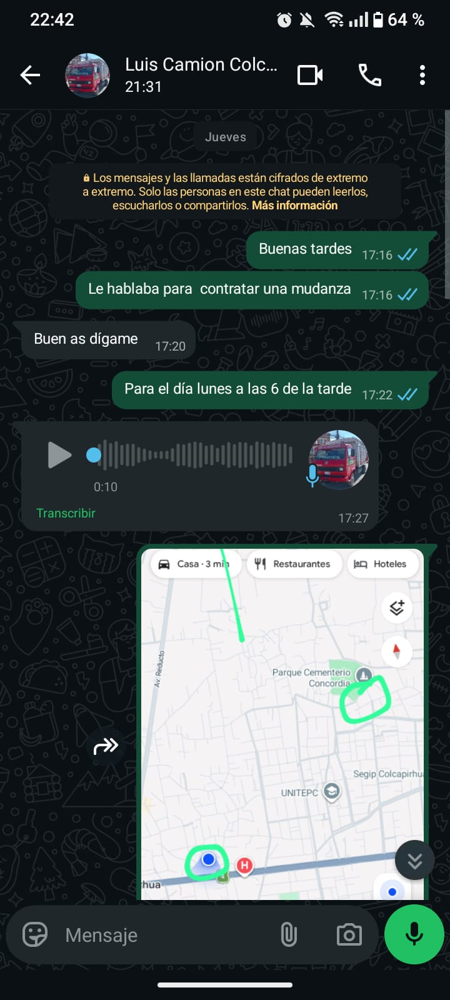
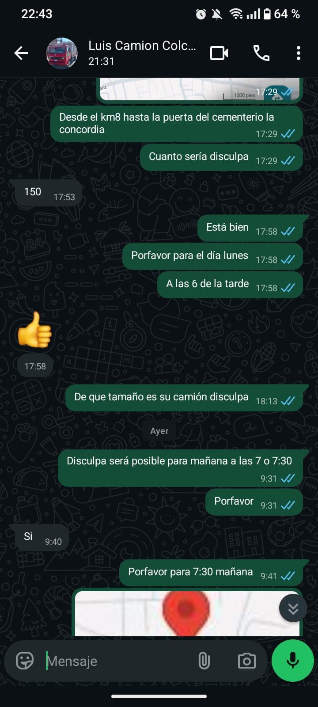
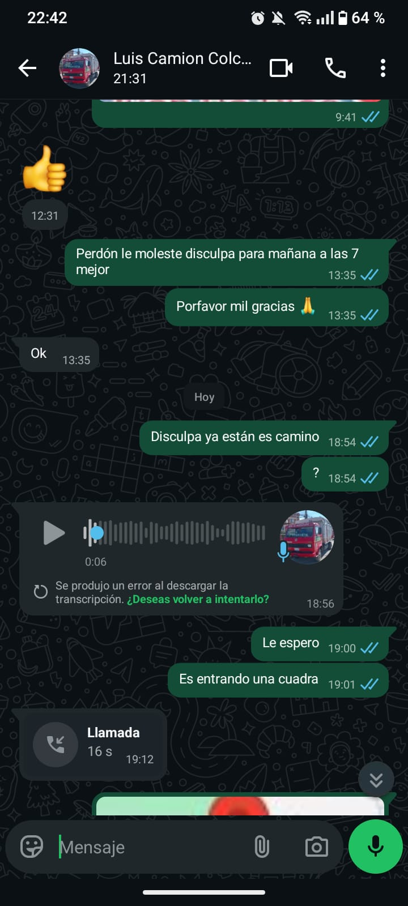
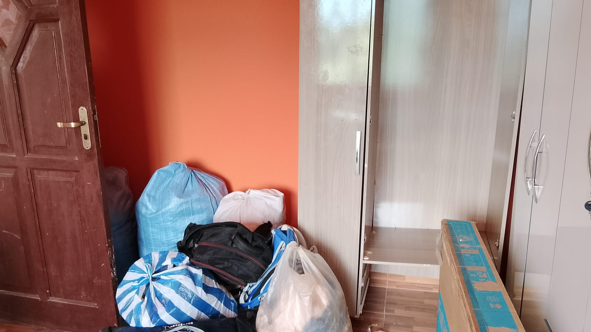
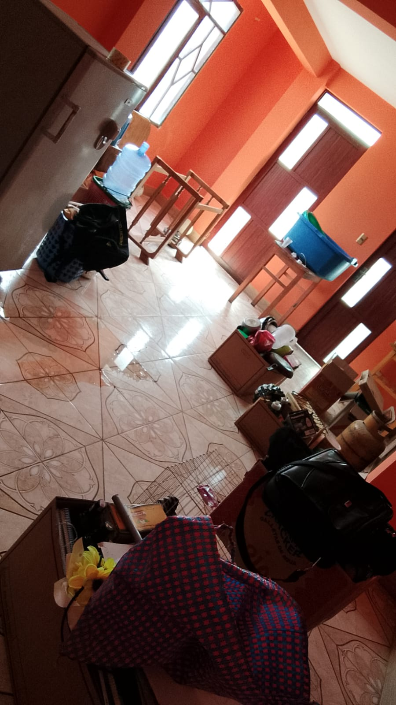
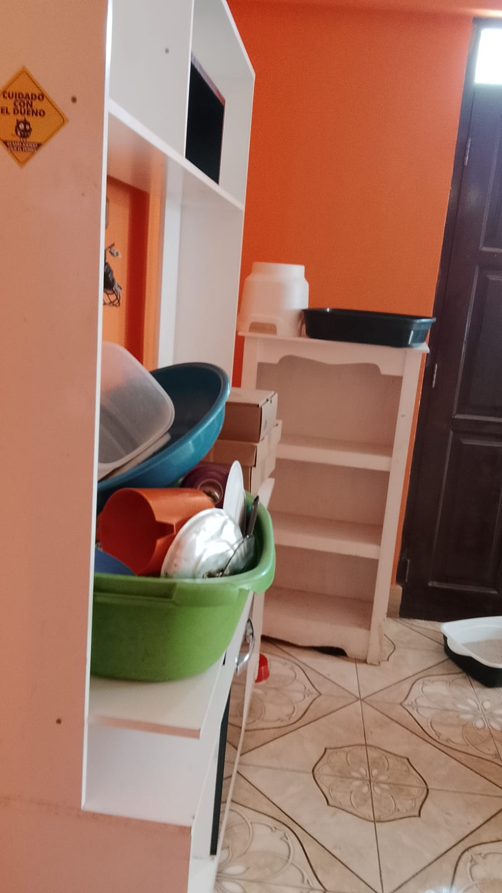

# Trabajo individual

Jhonatan Alvarado Mamani

##Clase 1 Apuntes <- Dos numerales es un subtitulo

Git es un sistema de control de versiones 
creado por Linus Torvalds GOD.

Instalar Git
```
sudo apt instal git
```

Las comillas son para crear bloques de codigo

----------------------------------------------------------

## Apuntes clase 2  

### Directorio de trabajo
Untraked sin seguimiento

Modified modificacion 

Para igonrar archivos

.gitignore 


### Comandos
Agrega un archivo al staged area
```
git add <archivo> 
```

Agrega todos los archivos al staged area
```
git add . 
```

Volver al estado anterior
```
gid restore --staged <archivo> 
```

### Commit punto de guardado, todos los cambios pasan al historial
```
git commint -m "mensaje" 
```
Volver al ultimo commit
```
git reset --soft HEAD-1 
```

### Buenas practicas para los commits
-Commits atomicos

-Maximo 50 caracteres

-Usar Verbos imperativos(Add, Change, Fix, Remove)

-Usar prefijos (feat, fix, perf, build, ci, docs, refactor, style, test)

----------------------------------------------------------

## Apuntes clase 3

### Git Hub repositorio remoto

Hay dos manera de vincular y subir el repositorio local a GitHub
mediante SSH y HTTPS, es mejor usar SSH key.

SHH se configura en GitHub, se necesita una key con el comando 
```
ssh-keygen -t ed25519 -C "correo@gmail.com"

```
Rama principal

Main 

Conectar repo local existente con uno a GitHub
```
git remote add origin git@github.com:User:Repo.git
```

Clonar repositorio
```
git clone "git@github.com:user:repo.git"
```

subir cambios
```
git push origin <rama>
```

bajar cambios
```
git pull origin <rama>
```

----------------------------------------------------------

## Apuntes clase 4

Ver las urls donde apunta nustra repo
```
git remote -v 
```

Vincula repo local  con uno en la nube
```
gir remote add <apodo> "url" 
```

cambia la  url donde apunta nuestro repositorio
```
git remote set -url <apodo> "url" 
```
### Configurar multiples ssh
Crear un archivo config para evitar conflicto de keys

verificar que funciona
```
ssh -T git@github-miname
```

### Git Chekout
Nos permite desplazar el HEAD hacia un punto 
especifico  de la historia o a otra rama
Inspeccionar, Restaurar, Experimentar,Cambiar

Usar solo para "ver"

### Estado Detached HEAD
El HEAD esta desacoplado, apunta directamente a un commit

Espectador del pasado, no se tiene rama

Los cambios no "encarnados" se pierden

Moverse a otro commit
```
git checkout <hash del commit>
```

Volver al ultimo hash  de la rama
```
git checkout <rama>
```

Guardar cambios  del "pasado,  encarnar"
```
git checkout <hashcommitcreado>
git checkout -b ramanueva
```

### Buenas practicas
-No trabajar mucho tiempo en Detached HEAD

-Limpiar el directorio de trabajo (add y commit)

-Usarlo para aprender de proyectos grandes, como crecieron


----------------------------------------------------------

## Apuntes clase 5 (Motivo de falta)

### Ramas
Birfucacion  del estado del codigo que crea un nuevo camino 

Comando para gestionar ramas
```
git branch
```

Lista las ramas y muestra en que rama esta nustro HEAD
```
git branch 
```

Crea una nueva rama a partir de la rama donde estamos
```
git branch <rama> 
```

Eliminar rama
```
git branch -D <rama>
```

Cambiar ramas
```
git checkout <rama>
```

Crear y cambiar a esa rama
```
git checkout -b <rama>
```

### git checkout  vs git switch
git checkout es multiproposito, cuidado

git switch es especializado para manejo de ramas


### gitflow basico
Flujo de trabajo, que tiene un marco de trabajo y convenciones 
que permite trabajar de manera ordenada en ramas

Ramas
-main -> codigo que se encuetra en produccion 

-develop -> rama ·pre-produccion· seran lanzadas pronto, probar del todo

-ramas de apoyo -> codigo editable se divide en

 feature, se trabajan nuevas caracteristicas del proyecto

 realease, preparacion de un lanzamiento de una nueva version

 hotfix, cambios imprevistos, parches, bugs o problemas de produccion


### Motivo de falta a la clase 5

Por motivos de mudanza (empacar, trasladar, desempacar,etc), no pude llenar el form de la asistencia
me conecte a la reunion finalizando la clase.

Adjunto evidencia (Las capturas son del mismo dia de la mudanza 27/04 y las fotos del dia siguinte xd)

<style>
  .galeria {
    display: grid;
    grid-template-columns: repeat(3, 1fr);
    gap: 10px;
    max-width: 900px;
  }

  .galeria img {
    width: 100%;
    height: auto;
  }
</style>

<div class="galeria">
  
  
  
  
  
  
</div>

----------------------------------------------------------

## Apuntes clase 6 (Motivo de falta)

Merge significa fusión, fusionar nuestras dos ramas en una sola
```
git merge
```

Con el flag –no-ff  significa no fast forward, fuerza a hacer un commit 
para el merge para guardarlo en el historial de commits
```
git merge –no-ff 
```

Verifica si hubo cambios en la rama y sus ramas hijas, avisa si hubo cambios
```
git fetch
```

Trae todos los cambios de la rama remota, si lo hubiera,(es como si lo actualizara), al repositorio local 
```
git pull
git pull origin rama
```

Sube los cambios del repositorio local al repositorio remoto
```
git push
```

Sube los cambios del repositorio local al repositorio remoto
```
git push origin rama
```

Si el repositorio es ajeno para la primer push se pone el flag -u 
para que no tenga que pedir permiso para crear la rama.
```
git pull origin -u rama
```

## Flujo de trabajo (Sin Pull Requests)
```
git checkout develop
git fetch
git pull origin develop
git checkout rama
git merge develop  (Solo si hubo cambios en develop)
```
## Trabajas en tu rama
```
git push origin rama # Agregas -u si es la primera vez que subes cambios al repositorio remoto
git checkout develop
git fetch
git pull origin develop
git merge –no-ff rama
```

## Resuelves manualmente los archivos fallidos y sus conflictos
```
git add .
git commit
[Ctrl + O, Enter, Ctrl + X](depende si usan nano)
git branch -D rama
git push origin develop
```

## Motivo de falta a la clase 6
Debido a la mudanza del dia anterior (lo meciono en los apunte de la clase 6)
en el traslado e instalacion de las cosas no pude llenar el form de la asistencia.

No asisti 2 dias por la mudanza, los demas dias no falte
Por favor auxi tengalo en cuenta :|
Gracias 

----------------------------------------------------------

## Apuntes clase 7

Es una solicitud o aviso a los miembros del equipo
sobre mergear o  unir el codigo realizados en una rama a 
otra.
```
pull Request
```

## Flujo de trabajo (Con Pull Requests)
```
git checkout develop
git fetch
git pull origin develop
git checkout rama # Agregas -b si estás creando la rama
git merge develop # Solo si hubo cambios en develop
```

### Trabajas en tu rama
```
git push origin rama # Agregas -u si es la primera vez que subes cambios al repositorio remoto
git checkout develop
git fetch
git checkout rama
git merge develop # Solo si hubo cambios en develop antes de hacer la PR
```

### Resuelves manualmente los archivos fallidos y sus conflictos
```
git add .
git commit
[Ctrl + O, Enter, Ctrl + X](depende si usan nano)
git push origin rama
```


Los PRs(Pull Request) se usan por temas de seguridad, notificando a los responsables de una solicitud de merge de una rama a otra, asi se podra revisar el codigo que se quiere unir evitando problemas, fallas o posibles ataques.
Esto da mayor manejo y garantiza mayor seguridad en trabajos colaborativos
Proteger los repositorios con limitacion de colaboracion es muy importante para moderar quienes y que aportes se mergean

## Apuntes clase 8

### git stash
Permite guardar cambios temporales(sin hacer commit) para cambiar de rama

-Cambiar de rama rápidamente

-No realizar un commit aún

-Guardar avances incompletos

### git diff
Muestra diferencias entre archivos, commits o el area de staging

- Revisar cambios antes de hacer commit

- Debugging

-Entender modificaciones en el codigo

### Conflictos
Ocurre cuando dos cambios afectan la misma línea o zona de un archivo

### Pasos para resolver un conflicto

Abrir el archivo con conflicto

Elegir que codigo mantener (o combinar ambos)

Eliminar los marcadores (<<<<<<<, =======, >>>>>>>)

Guardar el archivo

Marcar como resuelto

```
git add archivo
git commit
```